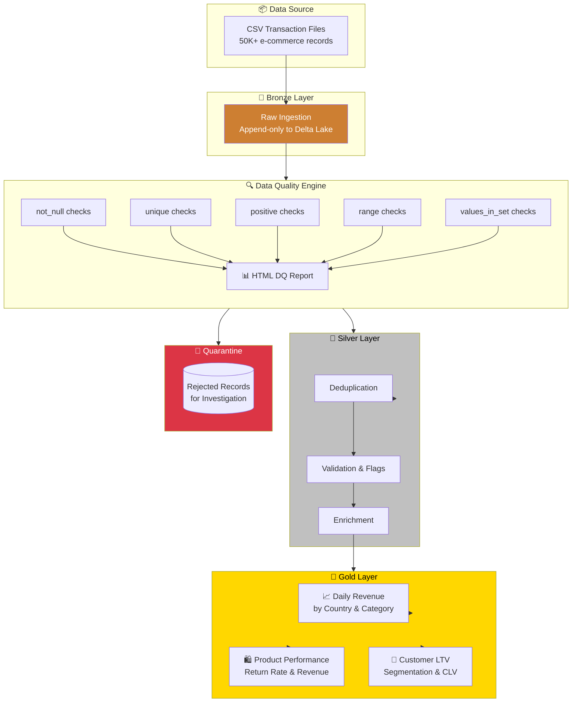

# 🏗️ Lakehouse-DQ-Pipeline — Data Quality Framework

<p align="center">
  
  
  
  
  
</p>

## 🎯 Project Overview

E-commerce data pipeline with a **Bronze/Silver/Gold Lakehouse architecture** and a **custom Data Quality framework** built on PySpark. Features a quarantine pattern for rejected records and generates HTML DQ reports for stakeholder visibility.

## 🏗️ Architecture



## 🚀 Features

- 🏗️ **Lakehouse architecture** with Bronze/Silver/Gold layers on Delta Lake
- 🔍 **Custom DQ framework** with 5 check types: `not_null`, `unique`, `positive`, `range`, `values_in_set`
- 🚫 **Quarantine pattern** — rejected records stored separately (zero data loss)
- 📊 **HTML DQ reports** — auto-generated pass/fail scorecards for stakeholders
- 🔄 **Idempotent** processing via Delta Lake MERGE upsert
- 👥 **Customer segmentation** — VIP / Regular / Occasional / One-time based on LTV

## 🔍 Data Quality Framework

| Check Type | Description | Example |
|-----------|-------------|---------|
| `not_null` | Column completeness rate | `transaction_id` >= 99% non-null |
| `unique` | Column uniqueness rate | `transaction_id` >= 98% unique |
| `positive` | Numeric positivity | `quantity` > 0 for >= 95% of rows |
| `range` | Numeric boundaries | `unit_price` between 0.01 and 10,000 |
| `values_in_set` | Categorical validation | `payment_method` in {credit_card, paypal, ...} |

Each check returns a `DQResult` dataclass with pass/fail status, metric, threshold, and details.

## 📂 Project Structure

```
Lakehouse-DQ-Pipeline/
├── 📁 notebooks/
│   ├── 01_bronze_ingestion.py        # Raw CSV to Delta Lake
│   ├── 02_silver_cleansing.py        # Dedup + DQ + Quarantine + Enrich
│   └── 03_gold_aggregation.py        # Revenue, Products, Customer LTV
├── 📁 src/
│   ├── data_quality/
│   │   ├── expectations.py           # DQ check functions
│   │   └── dq_report.py              # HTML report generator
│   └── generators/
│       └── ecommerce_generator.py    # Mock data with controlled errors
├── 📁 tests/
│   └── test_dq_checks.py            # 7 unit tests for DQ functions
├── 📁 config/
│   └── pipeline_config.yaml          # YAML-driven DQ thresholds
└── requirements.txt
```

## ⚙️ Setup & Run

```bash
pip install -r requirements.txt
python src/generators/ecommerce_generator.py
pytest tests/ -v
```

## 👨‍💻 Author

**Othmane Sadiki** — Data Engineer

[](https://www.linkedin.com/in/sadiki-othmane/)
[](https://github.com/othmanestd)
